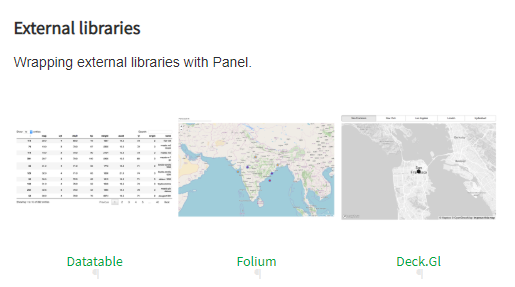

# Panel Extensions Template

WORK IN PROGRESS. JUST STARTED.

CONTRIBUTIONS ARE VERY, VERY WELCOME via

- [Panel Github Issue 1014](https://github.com/holoviz/panel/issues/1014) or
- [A new Github Issue](https://github.com/MarcSkovMadsen/panel-extensions-template/issues)

[Panel](https://panel.holoviz.org/) is a framework for creating **powerful, reactive analytics apps in Python using to tools you know and love**.

<a href="https://panel.holoviz.org/" target="_blank"></a>

The purpose of this repository is to **make it easy for Panel developers to create custom Panel extensions**.

Panel Extensions enables developers to compose existing Panel components into new reusable components or wrap an awesome javascript plotting library like [ECharts](https://echarts.apache.org/en/index.html) into a reusable Panel component.

In order to facilitate this, this repo contains

- Documentation (See below)
- Examples (See [examples](/examples/) folder)
- An Extensions Starter Template (See [src](/src/) folder)

## Extensions Overview

Panel supports three types of extensions *Inheritence Extensions*, *Bokeh Extensions* and *IPyWidgets Extensions*.

**Inheritence Extensions** are extensions that are created by inheriting from an existing layout, pane or widget.

An important sub category of Inheritence Extensions are called **HTML Extensions**. These extensions are created by inheriting from the `HTML` pane. You can use HTML, CSS and/ or JS to create amazing extensions to Panel. These extensions cannot communicate from the browser (Javascript) back to the server (Python).

Another important sub category of inheritence extensions is called **Composed Extensions**. These extensions are created by composing existing Panel components in a layout.

An upcoming, important sub category of Inheritance Extensions are called **Web Component Extensions**. They will provide you with the super powers of the Bokeh Extensions below for 80% of your use cases. But they require a minimum of javascript skills and are faster to develop.

**Bokeh Extensions** on the other hand supports efficient, bidirectional communication from server (Python) to the browser (Javascript) and back. It also gives you access to all the super powers of modern front end framework languages (js or typescript), tooling and frameworks like React, Vue and Angular. The layouts, panes and widgets that ships with Panel are Bokeh extensions.

The Bokeh extensions uses the [Bokeh Extensions](ttps://docs.bokeh.org/en/latest/docs/user_guide/extensions.html) api.

**IPyWidgets Extensions**. The [upcoming](https://github.com/holoviz/panel/blob/master/panel/pane/ipywidget.py) IPyWidget Pane enables users to use IPyWidgets in Panel. Therefore a developer might develop a Panel extension indirectly as an IPyWidget. This might come at a performance cost in relation to bundle size and general performance. If this matters in practice is yet to be confirmed.

The below table provides an overview of the different types of extensions.

| Extension Type            | Communication | Datasets | Wrap External JS library | Skill level* (You can do it &#x1f44d;)               |
|---------------------------|---------------|----------|--------------------------|------------------------------------------------------|
| Inheritence Extension     |               |          |                          |                                                      |
| \- HTML Extension         | One way       | Small    | Yes                      | Basic HTML, CSS and/ or JS                           |
| \- Composed Extension     | Bidirectional | Large    | Normally No              | Panel                                                |
| \- WebComponent Extension | Bidirectional | Large    | Yes                      | Basic HTML, CSS and/ or JS                           |
| Bokeh Extension           | Bidirectional | Large    | Yes                      | JS and Typescript
| IPyWidget Extension       | Bidirectional | Large    | Yes                      | IPyWidget, JS                                    |                                    |

\* Developing extensions in general requires a basic understanding of Python Class Inheritance and Panel.

## Examples

### HTML Extension Example

In this example we will develop a `Dynamic Number` extension that can display a number with the fontsize and green+alpha color ratios depending on the value.

[](examples/dynamic_number.py)

We start by importing the dependencies

```Python
import panel as pn
import param
```

Then we implement the HTML extension.

```python
class DynamicNumber(pn.pane.HTML):
    """Extension Implementation"""
    value = param.Integer(default=30, bounds=(0,100))

    def __init__(self, **params):
        # The _rename dict is used to keep track of Panel parameters to sync to Bokeh properties.
        # As value is not a property on the Bokeh model we should set it to None
        self._rename["value"]=None

        super().__init__(**params)
        self._update_object()

    # Don't name the function `_update` as this will override a function in the parent class
    @param.depends("value", watch=True)
    def _update_object(self, *events):
        self.object = self._get_html(self.value)

    def _get_html(self, value):
        """Main functionality of Extension"""
        font_size = value
        alpha = 1-value/100
        green = int(value*255/100)
        return f"""
    <div style="font-size: {font_size}px;color: rgba(0,{green},0,{alpha}">{value}</div>
    """
```

Finally we try out the extension

```Python
# Create app
extension = DynamicNumber(width=125, height=125)
app = pn.Column(
    extension,
    extension.param.value,
    width=150,
)
# Serve the app
app.servable()
```

### HTML Extension Reference Examples

**Click the images** below to see the code.

[](examples/dynamic_number.py)

[](examples/echarts_gauge_oneway.py)

The [Panel Gallery](https://panel.holoviz.org/gallery/index.html) contains more examples in the section called *External libraries*. Please note that these are not implemented by inheriting from the HTML pane. They just use it. It's not difficult to see how the examples could be converted to inheritance examples though.

[](https://panel.holoviz.org/gallery/index.html)

### Composed Extension Example

In this example we will develop a `DataFramePlotter` extension that enables a Panel user to select a column of a given DataFrame and see the associated `distplot`.

[](examples/data_plotter.py)

We start by importing the requirements

```python
import matplotlib.pyplot as plt
import pandas as pd
import panel as pn
import param
import seaborn as sns
```

Then we implement the *Composable Extension*.

```python
class DataFramePlotter(pn.Column):
    """Extension Implementation"""
    column = param.Selector()

    def __init__(self, data, **params):
        # The _rename dict is used to keep track of Panel parameters to sync to Bokeh properties.
        # As column is not a property on the Bokeh model we should set it to None
        self._rename["column"] = None

        super().__init__(**params)

        self._plot_pane = pn.pane.Matplotlib(background="blue", sizing_mode="stretch_both")
        self[:] = [self.param.column, self._plot_pane]

        # Please note that the alternative of setting
        # @param.depends("column", watch=True)
        # on _update_plot_pane does not work.
        # See https://github.com/holoviz/panel/issues/1060
        self.param.watch(self._update_plot_pane, "column")

        columns = data.columns.values
        self.param.column.objects = columns
        self.column = columns[0]
        # I need to set self.column to show a plot initially

    def _update_plot_pane(self, _):
        # - I get exception if plt.close is below ax line. See https://github.com/holoviz/panel/issues/1482
        # - The plot does not change if I remove plot.close() fully.
        plt.close()

        ax = sns.distplot(df[self.column])
        self._plot_pane.object = ax.figure
```

Finally we can use the extionsion.

```python
df = pd.DataFrame(data={"x": [1, 2, 3, 4, 5, 6, 7], "y": [1, 2, 2, 4, 5, 9, 7]})
DataFramePlotter(df, width=300, height=300).servable()
```

### Composed Extension Reference Examples

**Click the images** below to see the code.

[](examples/data_plotter.py)

### WebComponent Extension Example

COMING UP

### WebComponent Reference Examples

COMING UP

### Bokeh Extension Example

Now we start moving into Bokeh Extensions and Javascript territory.

Please note that in order for Bokeh Extensions to compile you will need to have [node.js](https://nodejs.org) installed. You can install it directly from their web site or via `conda install -c conda-forge nodejs`.

Before you read on I would ask you to quickly study the offical Bokeh documentation [Extending Bokeh](https://docs.bokeh.org/en/latest/docs/user_guide/extensions.html). You don't need to code and run the examples. After having read the official documentation I hope you have a basic understanding of

- the existence and location of official Bokeh documentation
- what a Bokeh extension is and how it is build.

We will now focus on Bokeh Extensions for Panel example.

In this example we will create a Panel `HTMLButton` extension that enables a user
to catch a click event from any HTML element he/ she would like as shown below.

[](examples/html_button/html_button.py)

CLICK ON THE VIDEO TO SEE THE CODE - WALK THROUGH COMING UP

### Bokeh Extensions Reference Examples

**Click the images** below to see the code.

[](examples/custom_bokeh_model)

[](examples/html_button/html_button.py)

### Bokeh Extensions included with Panel

Every layout, pane or widget in Panel is essentially a Bokeh Extension so a good place to get inspiration is to navigate the [Panel Reference Gallery](https://panel.holoviz.org/reference/index.html) to find an extension similar to the one you would like to implement and then study the code

[](https://panel.holoviz.org/reference/index.html)

You can find the code of the Panel components on Github via

- [Panel Layouts](https://github.com/holoviz/panel/tree/master/panel/layout)
- [Panel Panes](https://github.com/holoviz/panel/tree/master/panel/pane)
- [Panel Widgets](https://github.com/holoviz/panel/tree/master/panel/widgets)

and the underlying Bokeh extensions via

- [Bokeh Model Widgets](https://github.com/bokeh/bokeh/tree/master/bokehjs/src/lib/models/widgets)
- [Panel Bokeh Models](https://github.com/holoviz/panel/tree/master/panel/models)

## Prebuilt Bokeh Extensions

COPY FROM AWESOME-PANEL.ORG REPO - TO BE REVISED

In this document I will describe how I got **prebuilt bokeh model extensions** setup
as a part of the awesome-panel package. I needed it temporarily while waiting for the `WebComponent` PR to be reviewed and released by Panel.

Setting up prebuilt extensions using `Bokeh init --interactive` is briefly described in the Bokeh Docs. See [Bokeh Pre-built extensions](https://docs.bokeh.org/en/latest/docs/user_guide/extensions.html).

I hope this description can help others who would like to create prebuilt custom bokeh models for Bokeh or Panel.

### Steps

I navigated to the root of the awesome-panel package

```bash
cd awesome-panel/package
```

ran `bokeh init --interactive`

```bash
$ bokeh init --interactive
Working directory: C:\repos\private\awesome-panel\package\awesome_panel
Wrote C:\repos\private\awesome-panel\package\awesome_panel\bokeh.ext.json
Create package.json? This will allow you to specify external dependencies. [y/n] y
  What's the extension's name? [awesome_panel]
  What's the extension's version? [0.0.1]
  What's the extension's description? []
Wrote C:\repos\private\awesome-panel\package\awesome_panel\package.json
Create tsconfig.json? This will allow for customized configuration and improved IDE experience. [y/n] y
Wrote C:\repos\private\awesome-panel\package\awesome_panel\tsconfig.json
Created empty index.ts. This is the entry point of your extension.
You can build your extension with bokeh build
All done.
```

In the `package.json` I had to replace

```ts
"dependencies": {
    "bokehjs": "^2.0.2"
  },
```

with

```ts
"dependencies": {
    "@bokeh/bokehjs": "^2.0.2"
  },
```

See [bokeh init issue](https://github.com/bokeh/bokeh/issues/10055).

I also replaced the `tsconfig.json` contents with

```ts
{
  "compilerOptions": {
    "noImplicitAny": true,
    "noImplicitThis": true,
    "noImplicitReturns": true,
    "noUnusedLocals": true,
    "noUnusedParameters": true,
    "strictNullChecks": true,
    "strictBindCallApply": false,
    "strictFunctionTypes": false,
    "strictPropertyInitialization": false,
    "alwaysStrict": true,
    "noErrorTruncation": true,
    "noEmitOnError": false,
    "declaration": true,
    "sourceMap": true,
    "importHelpers": false,
    "experimentalDecorators": true,
    "module": "esnext",
    "moduleResolution": "node",
    "esModuleInterop": true,
    "resolveJsonModule": true,
    "skipLibCheck": true,
    "target": "ES2017",
    "lib": ["es2017", "dom", "dom.iterable"],
    "baseUrl": ".",
    "outDir": "./dist/lib",
    "paths": {
      "@bokehjs/*": [
        "./node_modules/@bokeh/bokehjs/build/js/lib/*",
        "./node_modules/@bokeh/bokehjs/build/js/types/*"
      ]
    }
  },
  "include": ["./**/*.ts"]
}
```

At least including the `path` section is needed to be able to `import { div, label } from "@bokehjs/core/dom"` like @philippjfr does in Panel.

In the `index.ts` file I imported my models

```ts
import * as AwesomePanel from "./express/models/"
export {AwesomePanel}

import {register_models} from "@bokehjs/base"
register_models(AwesomePanel as any)
```

In the `express/models/index.ts` file I exported the `WebComponent`.

```ts
export {WebComponent} from "./web_component"
```

Then I could `build` my extension

```bash
$ panel build
Working directory: C:\repos\private\awesome-panel\package\awesome_panel
Using C:\repos\private\awesome-panel\package\awesome_panel\tsconfig.json
Compiling TypeScript (3 files)
Linking modules
Output written to C:\repos\private\awesome-panel\package\awesome_panel\dist
All done.
```

The result is in the `dist` folder.

I discovered I did not even have to `serve` the `awesome_panel.js` file.

I could just `panel serve` something

## How to use the template

COMING UP - DESCRIBE HOW TO USE THE Template

## Contributing an extension to Panel

COMING UP

## Contribution the extension(s) as a Python Package on PYPI

COMING UP

## Resources

### Awesome Panel Extensions

COMING UP

### Awesome Extensions in Other Frameworks

- [Streamlit Component Gallery](https://www.streamlit.io/components)
- [Streamlit Embed Code](https://github.com/randyzwitch/streamlit-embedcode)
- Jupyter/ IpyWidgets/ Voila - TBD
- Dash - TBD

## Ideas for Awesome Extensions

The below is a list of Awesome Extensions I could come up with that I have currently (20200718) not seen examples of.

Feel free to use them as inspiration for a learning or contributing to the community.

Feel free to implement them in any of the awesome Python Frameworks (Bokeh, Dash, Panel, Streamlit or Voila). If they are implemented in one framework parts of the work can be reused across the frameworks.

### Python in the Browser - BrythonComponent

Wouldn't it be awesome if you could use Python in your browser instead of on the server only? Well it might be possible with [Brython](https://brython.info/index.html).

I would like to be able to write something like

```Python
BrythonComponent(python_code_string)
```

and see something like

[](https://brython.info/static_tutorial/en/index.html)

or

[](https://medium.com/swlh/sick-of-javascript-just-use-browser-python-4b9679efe08b)

powered by Python running in the Browser.

Maybe the extension can also support bidirectional communication?

I hope this could help you and the Python community create awesome things. I also hope it could help to get Python working in the browser in general.

### Python Scientific Stack in the Browser - PyodideComponent

Wouldn't it be awesome if you could use the Python Scientific Stack in the Browser? Well maybe you can with [Pyodide](https://hacks.mozilla.org/2019/04/pyodide-bringing-the-scientific-python-stack-to-the-browser/).

I would like to be able to write something like

```python
PyodideComponent(python_code_string)
```

and see something like

[](https://www.guangshi.io/posts/run-a-random-walker-in-your-website-using-pyodide/)

powered by the Python Scientific Stack running in the browser.

Maybe the extension can also support bidirectional communication?

I hope this could help you and the Python community create awesome things. I also hope it could help to get Python working in the browser in general.

## Tips & Tricks

### Start With a Working Example and Iterate

Developing extensions and Bokeh extensions in particular can be a bit tricky until you get familiar with it. You might get error messages that you don't understand or know how to solve. For me the best way to start a new extension is to

- Copy a simple example into your project.
  - For Bokeh extensions the [HTMLButton Extension](examples/html_button) is a good, simple example to start with.
- Test that it works via `panel serve` or similar and solve any problems that you might find.
- Stage (`git add`) the changes when the example works.

Then you do very small iterations of develop-test-stage. For example

- Rename folder. Test. Stage.
- Rename files. Test. Stage.
- Rename class (and similar) names in the files. Test. Stage.
- Add incremental functionality. Test. Stage.

Everytime you need to add incremental functionality, you can find the inspiration by studying the documentation or a similar example.

### Use Your Extension Across Frameworks

Wouldn't it be cool if your awesome panel extension could be used in another framework like Streamlit, Bokeh, Voila or Dash?

This is actually becoming more and more of a possibility.

The figure below provides an overview of how components currently can be used across frameworks.

To be determined:

- How to convert Plotly Dash? [jupyter-plotly-dash](https://pypi.org/project/jupyter-plotly-dash/)?

## FAQ

### Should I define default values on the Bokeh .ts, Bokeh .py or Panel .py Model?

TBD

## Roadmap

- How to Test
- How to Debug
- How to use VS Code efficiently to develop extensions
- How to use frameworks like React, Vue and maybe Angular
- Tips & Tricks
- FAQ
- Convert examples to notebooks.
- Integrate with official Panel site
     - For example as example Notebooks in the Gallery?

